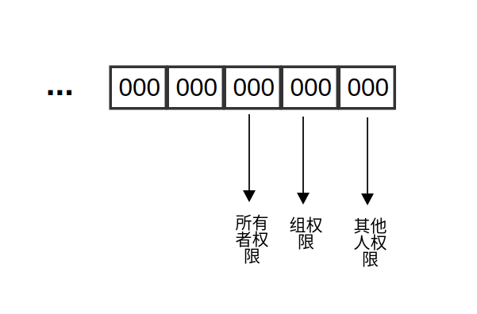

## 基础知识-Linux

> 转载请注明出处

### Linux进程如何通信？
Reference： [manual_1][detail_ref], [manual_2](http://man7.org/linux/man-pages/man2/), [The Linux Programmer's Guide](https://www.tldp.org/LDP/lpg-0.4.pdf)

Linux的进程通信手段基本上是从Unix平台上继承而来。
AT&T的贝尔实验室对Unix早期的进程间通信手段进行了系统的改进和扩充，形成了“System V IPC”,进程通信局限于单个计算机。
BSD的改进形成了基于套接字(Socket)的进程间通信机制，不再局限于单个计算机。
~~~
Unix  |-----> System V IPC   |
IPC	  |-----> Socket IPC     | ------> Linux IPC
	 	-->	  Posix IPC	     |
~~~

Posix IPC是IEEE开发的一个独立的Unix标准，包括：Posix消息队列，Posix信号量，Poisx共享内存区。
以下主要介绍Linux下进程间通信的几种主要手段：

#### 管道(Pipe)及有名管道(named Pipe):
管道可用于具有亲缘关系进程间的通信，有名管道克服了管道没有名字的限制，因此，除具有管道所具有的功能外，它还允许无亲缘关系进程间通信；
此外, 管道是单工通信, 固定一端发送，另外一端接受. 如果实现全双工通信, 必须同时设计两个管道. 一个管道有分别有两个读写描述符, 分别由两个进程去控制.

1. 管道通信:

~~~
#include <unistd.h>
int pipe(int fd[2]);
~~~

内存中实例化一个管道, 返回两个文件描述符, fd[0],fd[1]分别为管道的读写文件描述符. 实际操作中, 读管道的时候需要关闭fd[1]; 写管道的时候需要关闭[0].
管道实例化, 在fork之后. 无名管道只是内存中的特殊文件, 没有名字, 只能在父子进程中进行通信. 具体实现参见[demo][ipc_demo_pipe]代码.

> 注: demo中的通信都是阻塞的, 即当一个进程准备从空管道执行read时, read阻塞直到管道数据可用. 当一个进程执行write时, write将会阻塞, 直到管道数据被读取, 才会write结束返回.
> 本demo例子中, 使用就是该阻塞式通信, 如果使用非阻塞的话, 可用使用以下pipe2方法去实例化管道, flag值标记为O_NONBLOCK, 具体细节参考

[Reference][pipe_ref]
~~~
/* support by kernel 2.6.27 and later version */
#include <fcntl.h>              
#include <unistd.h>
int pipe2(int pipefd[2], int flags);
~~~

2. 有名管道(named Pipe or FIFO):
[Reference][fifo_ref]

~~~
#include <sys/types.h>
#include <sys/stat.h>
int mkfifo(const char *pathname, mode_t mode);
~~~
mkfifio会在本地文件系统中实例化出一个特殊文件, 返回值0表示成功, -1表示error. 同样这里也是阻塞式通信, 非阻塞式通信使用fifo函数.
在具体实现中, 需要注意我们在实例化特殊文件时, 进程双方得统一管道名才能通信.
具体实现有点类似与客户端服务端通信实现, [read][ipc_demo_fifo_r]端, [write][ipc_demo_fifo_w]端.

#### 消息队列(message queue):
消息队列是消息的链接表，有足够权限的进程可以向队列中条件消息，被赋予读权限的进程则可以读走队列中的消息。
消息队列克服了信号承载信息量小，管道只能承载无格式字节流和缓冲区大小受限等缺点。

~~~
#include <sys/types.h>
#include <sys/ipc.h>
#include <sys/msg.h>

key_t ftok(const char * pathname, int proj_id)
int msgget(key_t key, int msgflg);
int msgsnd(int msqid, const void *msgp, size_t msgsz, int msgflg);
ssize_t msgrcv(int msqid, void *msgp, size_t msgsz, long msgtyp, int msgflg);
int msgctl(int msqid, int cmd, struct msqid_ds *buf);
~~~

使用msgget生成消息队列, 发送端使用msgsnd发送消息到共享队列中, 接收端使用msgrcv从消息队列中接受消息, ftok用于生成共同的消息队列秘钥. 在程序执行完最后如果没有执行msgctl的IPC_RMID清理消息队列，则会被保留.  如果被保留也可通过ipcs -q 查看残余消息队列, 消息队列删除可通过ipcrm -q "mgsid".
> 注： 在实现过程中注意使用非阻塞式通信, 我的实现方式是在client端或者serve端都执行fork函数, 得到两个进程, 这两个进程分别负责接受和发送, 基本和计网课程中socket非阻塞式通信类似.
>(主要是在使用IPC_NOWAIT这个msgflag值时, client和serve端老是接受顺序不对, 顾舍弃这种做法, 换成原始的多线程负责接受和发送的实现方式) 

客户端[demo][ipc_msg_client], 服务端[demo][ipc_msg_serve]

#### 共享内存(Shared memory):
使得多个进程可以访问同一块内存空间，是最快的可用IPC形式。
针对其他通信机制运行效率较低而设计的，往往与其他通信机制，如信号量结合使用，来达到进程间的同步及互斥。

~~~
#include <sys/ipc.h>
#include <sys/shm.h>

int shmget(key_t key, size_t size, int shmflg);
void *shmat(int shmid, const void *shmaddr, int shmflg);
int shmdt(const void *shmaddr); 
int shmctl(int shm_id, int cmd, struct shmid_ds *buf);
~~~
当用shmget函数创建一段共享内存时, 必须指定size, 实际分配的大小是根据size四舍五入到PAGE_SIZE的倍数. 如果引用一个已经存在的共享内存, 则将size指定为0.
当一段共享内存被创建以后，它并不能被任何进程访问。必须使用shmat函数连接该共享内存到当前进程的地址空间，连接成功后把共享内存区对象映射到调用进程的地址空间，随后可像本地空间一样访问。
shmdt函数是用来断开shmat建立的连接的。注意，这并不是从系统中删除该共享内存，只是当前进程不能再访问该共享内存而已。
shmctl函数可以对共享内存执行多种操作，根据参数cmd执行相应的操作。常用的是IPC_RMID（从系统中删除该共享内存）。

#### 信号量(Semaphore):
[//]: 主要作为进程间以及同一进程不同线程之间的同步手段
信号量本质上是一个计数器，用于实现进程间的互斥和同步，而不是用于存储进程间通信数据。众多操作系统教材介绍的用于防范死锁的PV操作就是用信号量去实现。
强调的是程序对信号量的操作都是原子操作。

~~~
#include <sys/types.h>
#include <sys/ipc.h>
#include <sys/sem.h>

int semget(key_t key, int nsems, int semflg);
int semop(int semid, struct sembuf *sops, unsigned nsops);
int semtimedop(int semid, struct sembuf *sops, unsigned nsops, struct timespec *timeout);
int semctl(int semid, int semnum, int cmd, ...);
~~~
semget成功时返回指定信号量集合的id，nsems用于指定数量。  
每个信号量都会绑定以下一些值（注意这里的一个id可能对应多个信号量，指的是每个信号量不是每个id），
~~~
unsigned short  semval;   /* semaphore value */
unsigned short  semzcnt;  /* the count of threads waiting for zero */
unsigned short  semncnt;  /* the count of threads waiting for increase */
pid_t           sempid;   /* PID of process that last */
~~~
semop对指定的semid进行操作，sops用来描述该id下指定序号的信号量执行相应操作的结构体，nsops用来描述操作信号量个数。(注意当nsops不为1时，说明操作信号量数大于1，这里的sops得替换成sembuf的数组)，其中，sembuf结构体包含以下元素：
~~~
unsigned short sem_num;  /* semaphore number */
short          sem_op;   /* semaphore operation */
short          sem_flg;  /* operation flags */
~~~
sem_num是被操作的信号量的编号。  
sem_op是对信号量的操作，有三种类型：
- sem_op > 0: 系统会将其加到semval的值上。
- sem_op = 0: 调用的进程等待直到信号量的值为0。
	- if semval is zero, the operation can immediately proceed.
	- if semval is non-zero:
		- if **IPC_NOWAIT** is specified in sem_flg, semop() fails with errno set to **EAGAIN**
		- Otherwise, semzcnt is incremented by one and the thread sleeps until one of the following occurs:
			- semval becomes 0, at which time the value of semzcnt is decremented.
			- The semaphore set is removed: semop() fails, with errno set to **EIDRM**.
			- The calling thread catches a signal: the value of semzcnt is decremented and semop() fails, with errno set to EINTR
- sem_op < 0: 系统将从semval的值上减去该值。 
	- semval >= |sem_op|, the operation can proceed immediately
	- semval < |sem_op|:
		- if **IPC_NOWAIT** is specified in sem_flg, semop() fails, with errno set to **EAGAIN**
		- semncnt is incremented by one and the thread sleeps until one of the following occurs:
			- semval becomes greater than or equal to the absolute value of sem_op: the operation now proceeds, as described above.
			- The semaphore set is removed from the system: semop() fails, with errno set to **EIDRM**.
			- The calling thread catches a signal: the value of semncnt is decremented and semop() fails, with errno set to **EINTR**.

> 注： 这里边还提到了一个变量semadj，因为我没有阅读源码看的也全是文档，没看到有用到这个变量，所以在一些case中需要对它处理的我都给忽略了。

sem_flg中被识别的flag值是**IPC_NOWAIT**和**SEM_UNDO**。如果指定**SEM_UNDO**，当进程终止时会被自动阻塞。

测试[demo](./demo/linux/1/sem_ipc_test.c)
#### 套接字(Socket):
更为一般的进程间通信机制，可用于不同机器之间的进程间通信，可用于分布式的进程通信，就是网络中的那套搞法，本文忽略它的实现。

#### 小结

其实进程通信里，还有一个signal没有提到，它和pipes，named pipes都是早期进程通信的手段，效率都比较低，通信的数据量也较小。
一般开发中常用的应该是还是后面三种，消息队列，共享内存，信号量。这也都是System V中的IPC通信的核心，Linux使用ipcs命令可以查看系统中所有的消息队列，共享内存，信号量。
这三者，在开发上有很多的相似之处，关于IPC系统调用的函数如下所示：

Get | Ctl | Op
---- | ---- | ----
msgget | msgctl | msgop
semget | semctl | semop
shmget | shmctl | shmop

其中Get用于创建，返回值都是对应的id。  
Ctl提供了一系列操作指令，比如：IPC_STAT, IPC_SET, IPC_RMID等等。
Op提供了对应IPC上的特殊操作，比如： msgop包括msgsnd和msgrcv操作，shmop包括shmat和shmdt操作，semop就是其本身。

关于本文所有测试用的例子都在文件[demo][ipc_demo_code]下, 以下给出一些常用的宏定义, 至于不同通信方式对应的flag值, 请查看相关的manual

Available Values for oflag

Value	|	Meaning
--------- | ----------
O_RDONLY  |	Open the file so that it is read only.
O_WRONLY  |	Open the file so that it is write only.
O_RDWR	  |	Open the file so that it can be read from and written to.
O_APPEND  |	Append new information to the end of the file.
O_TRUNC	  |	Initially clear all data from the file.
O_CREAT	  |	If the file does not exist, create it. If the O_CREAT option is used, then you must include the third parameter.
O_EXCL	  |	Combined with the O_CREAT option, it ensures that the caller must create the file. If the file already exists, the call will fail.

Available Values for mode

Value	|	Meaning
--------- | ----------
S_IRUSR	  |	Set read rights for the owner to true.
S_IWUSR	  |	Set write rights for the owner to true.
S_IXUSR	  |	Set execution rights for the owner to true.
S_IRGRP	  |	Set read rights for the group to true.
S_IWGRP	  |	Set write rights for the group to true.
S_IXGRP	  |	Set execution rights for the group to true.
S_IROTH	  |	Set read rights for other users to true.
S_IWOTH	  |	Set write rights for other users to true.
S_IXOTH	  |	Set execution rights for other users to true.

此外再说下关于编程里用到的各种int型的flag，其实它都是标记的一个一个比特，如果熟悉的话，可以直接用8进制的数代替，参考下图：

每个flag值的最右边9位分别都是用来控制读，写，执行权限的，从第十位开始依次用来做标记，比如：**IPC_CREAT**用第10位标记，**IPC_EXCL**用第11位标记，**SHM_HUGETLB**用第12位标记, **SHM_NORESERVE**用第13位标记等等， 所以如果编程过程中出现各种flag个错误或者权限错误可以更加清楚的调整。

[detail_ref]: https://www.tldp.org/LDP/lpg/node7.html
[ipc_demo_code]: ./demo/linux/1
[pipe_ref]: https://linux.die.net/man/7/pipe
[ipc_demo_pipe]: ./demo/linux/1/pipe_ipc_test.c
[read]: ./demo/linux/1/pipe_fifo_test_r.c
[write]: ./demo/linux/1/pipe_fifo_test_w.c
[fifo_ref]: https://linux.die.net/man/3/mkfifo
[ipc_msg_client]: ./demo/linux/1/msg_que_test_s.c
[ipc_msg_serve]: ./demo/linux/1/msg_que_test_w.c
[ipc_demo_fifo_r]: ./demo/linux/1/pipe_fifo_test_r.c
[ipc_demo_fifo_w]: ./demo/linux/1/pipe_fifo_test_w.c