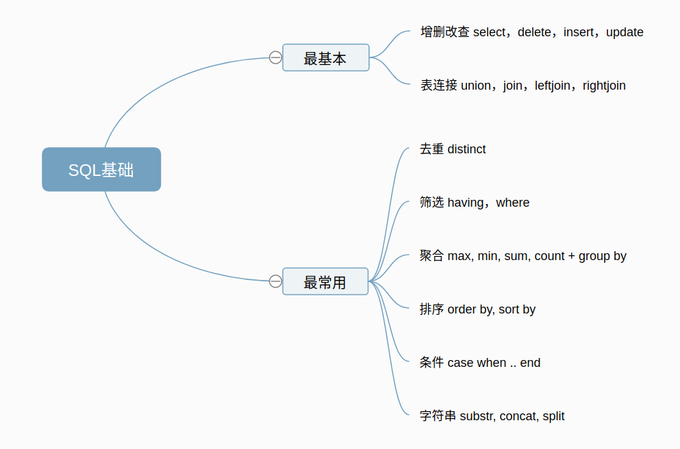

# 数据库-sql

Reference： [1](https://zhuanlan.zhihu.com/p/61805956)

本篇主要介绍sql语句的使用，因为自己做过好几个开发项目，面试官有时会问道一些sql的相关问题，这里做个总结。
前两天正好看到知乎上有人写的一个关于sql面试的总结[1]，写的蛮不错，我也是按照这个思路开始整理的。

## 框架图

## 基本使用

- 查询
~~~ 
// 从table中选择a这一列
select a from table;
~~~ 
- 表连接
    - union： 将两张表的字段合并起来，从合并的集合中检索
    - join： 找出两张表字段匹配的交集
    - left join： 左连接，以左表为准，逐条去右表找可匹配字段。如果找到列出，找不到为NULL
    - right join: 右连接，以右表为准，逐条去左表找可匹配字段。如果找到列出，找不到为NULL
    - full outer join: 包含两个表的连接结果，如果左表缺失或者右表缺失的数据会填充NULL

~~~
//以MySQL为例
show tables;
+----------------+
| Tables_in_test |
+----------------+
| info           |
| user           |
+----------------+
select * from info;  
+----+------+----------+
| id | age  | city     |
+----+------+----------+
|  1 |   20 | hefei    |
|  2 |   30 | beijing  |
|  3 |   25 | shanghai |
+----+------+----------+
select * from user;
+----+--------+--------+
| id | name   | passwd |
+----+--------+--------+
|  1 | libai  | 12345  |
|  2 | Jon    | 12345  |
|  3 | Tiktok | 12345  |
+----+--------+--------+
// union 搜索的结果简单合并，列的数量保持一致
select id, name from user union select id, age from info;
select name from user where id=1 union select age from info where id=1;
// join  找出两张表字段匹配的交集
select a.id, a.name, b.age from  
(select id, name from user) a  // 将select的结果记为临时表a
join  
(select id,age from info) b // 将select的结果记为临时表b
on a.id = b.id;
+----+--------+------+
| id | name   | age  |
+----+--------+------+
|  1 | libai  |   20 |
|  2 | Jon    |   30 |
|  3 | Tiktok |   25 |
+----+--------+------+
~~~

## 最常见使用
- distinct 去掉检索结果中重复的项
- where 从检索结果中筛选出匹配条件的项
- group by 将一个或多个列结果集进行分组后，再执行聚合函数max,min,avg
- order by 将检索后的结果排序

~~~
// distinct
// 罗列不同的age
select distinct age from info;

// group by
// 统计不同性别（F、M）中，不同的id个数
select count(distinct id) from info
group by city
// 其它的聚合函数例如：max/min/avg/sum

// max/min/avg等
// 统计最大/最小/平均年龄
select  max(age), min(age),avg(age) from info
group by id

// order by
// 按年龄全局倒序排序取最年迈的10个人
select id,age from info order by age DESC 
limit 10
~~~