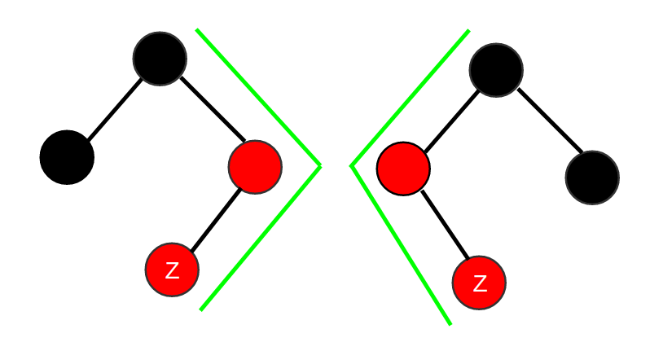
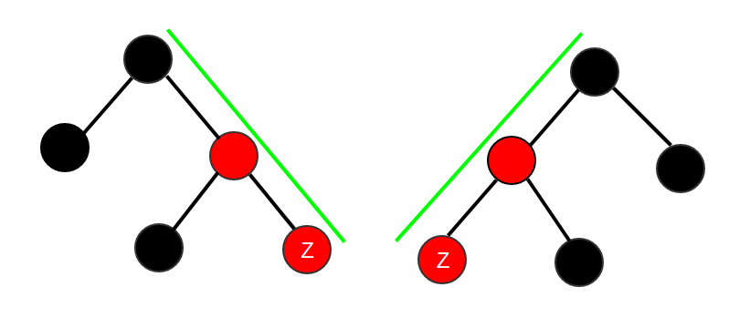

# 算法-红黑树

学算法的时候大多会听说，问什么数据结构最难，一般回答是“最难不过二叉树”。二叉树内容十分丰富，简单罗列成以下内容：

- 满二叉树，完全二叉树（树高logn+1）
- 二叉检索树，包括基本操作，插入删除检索等
- AVL平衡二叉树
- 红黑树
- 2-3树，B树

其中最具代表性的是红黑树，实际用的也非常广泛，在C++的STL中容器map就是用红黑树实现，一些操作系统中的文件管理用的也是红黑树。
本文主要介绍红黑树，及其相关操作，包括插入，删除，检索等

## 定义和性质

定义：  
- 每个节点只有红黑两种颜色
- 根节点黑色
- 如果一个节点是红色的，它的孩子节点都是黑色的
- 任意节点到后代叶子节点的简单路径中，均包含相同数目的黑色节点

注：
> 在算法导论书中，定义还有一条，“每个叶子（NIL）节点都是黑色的”。如果严格按照书上的实现的话，最坏情况下叶子节点NIL的个数为$2^(2lg(n+1)-1)$。
尽管加上叶子节点NIL会使得分析更加的简单，但却会带来额外NIL节点的存储开销。所以我在编程过程中，避免了NIL的使用，仍然满足上述定义。这也导致了不能完全按照书上的代码写，
因为它的伪码都是基于叶子节点为NIL的情况下来写的，我们需要在此基础上添加一些边界判断条件。

性质：
- 红黑树的高度至多为2log(n+1)
    - 证明可由定义第三条，推广，即根到叶节点的任何一条简单路径上都至少有一半的节点为黑色

黑高的定义：
- 节点x出发（若有NIL节点则不含该节点；若无则包含）到达一个叶节点的任意一条简单路径上的黑色节点个数称为该节点的黑高。

## AVL树和红黑树

AVL树经常会被拿来和红黑树作对别，下面简述两者的区别。  
相同点：  
- AVL数和红黑树的插入，删除，检索操作均为$O(logn)$

不同点：
- AVL树平衡度更高于红黑树，AVL树的最大高度为log(n+1);红黑树的最大高度为2log(n+1);
- AVL树的插入操作，旋转操作较为频繁，只要左右子树节点数目相差1以上就会旋转，但由于AVL树高度抵御红黑树所以检索操作效率较高。

综上所述，红黑树使用于插入删除操作较为频繁的场景，比如：文件系统，C++容器map等。AVL树适用于插入删除操作不频繁，检索频繁的场景。

## 插入

插入的节点颜色标为红色，首先遍历红黑树找到插入位置，然后执行fixup操作，维护红黑树性质。
遍历就是二分查找，复杂度就是树的高度。fixup操作共分为以下6种case：

- 父节点为左孩子
    - 叔节点为红色                        --case 1
    - 叔节点为黑色
        - 插入节点或当前节点为右孩子        --case 2
        - 插入节点或当前节点为左孩子        --case 3
- 父节点为右孩子
    - 叔节点为红色                        --case 4
    - 叔节点为黑色
        - 插入节点或当前节点Z为左孩子        --case 5
        - 插入节点或当前节点Z为右孩子        --case 6

case 1，4：重新着色  
case 2，5：旋转父亲节点  
case 3，6：旋转祖先节点，后重新着色

这个怎么记呢？我是这样记的,首先4,5,6和1,2,3是完全左右对称的。此外，

当碰到这种叔节点黑色，”三角形“的情况，均属于case 2，4情况，父亲节点旋转。如下图：

当碰到这种叔节点黑色，“直线”的情况，祖先节点旋转并重新着色，属于case 3，6的情况，case 3,6执行完就能满足红黑树定义。一次fixup中只会运行一次。如下图：

插入操作中最坏情况下，是1,2,3或4,5,6三种case都运行的情况，最多只会旋转两次，且case 3或6一直回朔到根节点才旋转。因为重新着色和旋转操作，都是常数级复杂度$O(1)$,树高最高为$2log(n+1)$.加上遍历红黑树和插入节点复杂度$\Theta(2log(n+1))$,所以插入操作的复杂度为$O(logn)$.

## 删除

删除操作较为复杂，首先删除节点就分成4种case，删除后的fixup分成8种case。删除节点和二叉检索树类似，不打算写二叉检索树了，所以这里详细写下删除节点的4种case。

删除节点x
- x无左孩子                      --case 1
- x有左孩子
    - x无右孩子                  --case 2
    - x有右孩子
        - 后继节点为右孩子        --case 3
        - 后继节点非右孩子        --case 4

case 1：右子树移植到删除节点位置  
case 2：左子树移植到删除节点位置  
case 3：后继节点的右子树移植到删除节点位置  
case 4：后继节点的右子树移植到后继节点位置

Fixup操作
- x是左孩子节点
    - x的兄弟节点w红色                  --case 1
    - x的兄弟节点w黑色
        - w节点两个子节点黑色            --case 2
        - w节点左孩子红色
            - w节点右孩子黑色           --case 3
            - w节点右孩子红色           --case 4
- x是右孩子节点
    - x的兄弟节点w红色                  --case 5
    - x的兄弟节点w黑色
        - w节点两个子节点黑色            --case 6 
        - w节点右孩子红色
            - w节点左孩子黑色           --case 7
            - w节点右孩子红色           --case 8

首先case 1,2,3,4和case 5,6,7,8完全左右对称。这个case划分完全是按照书上来的，我也没什么好的记忆方法。
只能说它的这种case划分比较的完备，把所有情况都给考虑进去了。

## 实例
我自己写的一个[demo](./demo/algorithm/tree_RBT).

注意事项：
- 为了更好的封装性，不推荐在main函数里new节点，建议在insert函数中new
- 控制好内存的分配和释放，我的做法是insert中new节点，删除和析构函数中delete节点，其中析构函数是从root节点深度遍历，delete节点
- 有些插入删除的子函数建议放到private

最后真是服气红黑树的提出者，真的十分巧妙，叹为观止。