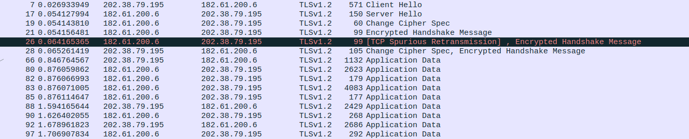

# TLS 

Reference: [RFC5246](https://tools.ietf.org/html/rfc5246)， [RFC8446](https://tools.ietf.org/html/rfc8446)

本文介绍TLS协议流程和TLS1.2到1.3的变化

## TLS协议(传输层安全协议 version 1.2) 

TLS协议一方面能在通信双方建立安全的链接，另一方面协商出一个共同的会话密钥，用于之后https协议中通信内容的加密。  
RFC文档中给出了TLS的四个目标：
- Cryptographic security（加密安全性）：能在通信双方建立安全链接
- Interoperability（互通性）：简而言之程序员能够通过TLS成功的交互加密参数，无论对方的代码怎么样的。
- Extensibility（可扩展性）：TLS旨在提供一个框架，必要是可以添加新的公钥和批量加密的算法。
- Relative efficiency（相对效率）：TLS协议中关于公钥的运算是CPU密集的。为了提高效率，TLS协议已经包含了一个可选的回话缓存方案，以减少需要从头开始建立的连接数。

具体TLS协议的握手过程，就直接摘自RFC文档
~~~
Client                                               Server

ClientHello                  -------->
                                                ServerHello
                                                Certificate*
                                        ServerKeyExchange*
                                        CertificateRequest*
                            <--------      ServerHelloDone
Certificate*
ClientKeyExchange
CertificateVerify*
[ChangeCipherSpec]
Finished                     -------->
                                        [ChangeCipherSpec]
                            <--------             Finished
Application Data             <------->     Application Data
~~~
 Figure 1.  Message flow for a full handshake

> \* Indicates optional or situation-dependent messages that are not always sent.

~~~
Client                                                Server

ClientHello                   -------->
                                                ServerHello
                                        [ChangeCipherSpec]
                            <--------             Finished
[ChangeCipherSpec]
Finished                      -------->
Application Data              <------->     Application Data
~~~
Figure 2.  Message flow for an abbreviated handshake

其中ChangeCipherSpec信息作为标记信息存在，用于通知接受方后续通信将受到协商的CipherSpec和密钥的保护。

从图中也能看出TLS握手的过程，除了一个重传包外基本和缩写版的Figure 2完全一致。  
具体的抓包文件见[链接](./File/TLSv1.2.pcapng)。（此外我是按照端口过滤，源文件是Multipath-TCP链接，实际看的时候看43216或者43218端口，
然后按照协议排序，这样会更加直观，能够关注到TLS核心过程，忽略相应的TCP ack包）

以下我再简单的解释下协商出的Master Key生成过程：  
- Hello阶段，需要就算法版本，随机数等基本信息达成一致
- 协商阶段，验证数字证书合法性来保证通信双方身份的合法性，之后开始协商密钥
- 协商出密钥后，所有通信的信息均使用改密钥进行AES加密通信。

以下是TLS握手协议的overview原文：
~~~
-  Exchange hello messages to agree on algorithms, exchange random values, 
    and check for session resumption.

-  Exchange the necessary cryptographic parameters to allow the client 
    and server to agree on a premaster secret.

-  Exchange certificates and cryptographic information to allow the client 
    and server to authenticate themselves.

-  Generate a master secret from the premaster secret and exchanged random values.

-  Provide security parameters to the record layer.

-  Allow the client and server to verify that their peer has calculated the same security parameters 
    and that the handshake occurred without tampering by an attacker.
~~~

## TLS 1.3

TLS1.3是18年8月推出的，以下主要介绍TLS 1.3与TLS 1.2的主要区别，观点主要摘自TLS1.3 RFC文档。

- 支持的对称加密算法被削减，目前保留的是所有的AEAD（ Authenticated Encryption with Associated Data）算法。
密码套件的概念从record protection algorithms和hash中分成，认证和密钥交换机制。这里hash被用于生成密钥和握手中的消息认证码。

- 加入0-RTT模式，对一些应用数据来说，以某些安全属性为代价，在setup过程中节约了一轮通信。

- 静态的RSA和DH密码套件被移除；所有的基于公私钥的密钥交换机制现在保持前瞻性的安全性。

> 具体就是静态的一些安全参数尤其是RSA中用的一些大素数，它的选取得满足额外的一些条件，否则容易被一些筛法去分解。总而言之，以前的实现被找出了一些漏洞，现在给补上。

- 所有在ServerHello信息之后的握手信息现在都被加密。新引入的EncryptedExtensions信息允许过去在ServerHello中明文发送的扩展受到隐私保护。

- 重新设计了密钥生成算法。由于提高的密钥分割属性，新设计能够更加容易地被密码学家分析。HMAC-based Extract-and-Expand Key Derivation Function (HKDF）被作为基础的原语。

- TLS握手协议的状态机被重新设计，移除了多余的信息比如：ChangeCipherSpec (除非兼容性需要)

- 椭圆曲线算法现在在基本的规范中，新的签名算法比如:EdDSA被包含。TLS 1.3移除了点格式的协商，对于每个曲线赞成使用单一点格式。

- 其他的密码学方面的提升，包括：改变RSA padding是的能使用RSA概率签名方案（RSASSA-PSS）, 移除了压缩，DSA签名，习惯性Ephemeral Diffie-Hellman（DHS）组。

- 不推荐使用TLS 1.2版本协商机制，而是使用扩展中的版本列表。增加了与现有的错误实现版本协商服务器的兼容性。

- 有无服务端状态的session恢复和早期的基于PSK的密码套件被单一新的PSK交换所替换。

目前网站使用大部分还是TLS1.2为主，我给出的一个wireshark的抓包文件，就是以百度为例，用的还是TLS1.2版本。